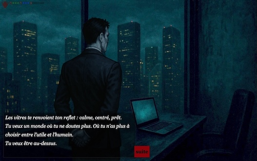

# Søren's macros for Twine SugarCube v2.37

 A few tips or JS that may be useful to others.
This doc on my Github repo : https://github.com/Dispositif/soren-twine-macros

Passage display :
- [LookLink](#looklink)
- [Metadata macro](#metadata-macro)
- [Decrypt](#decrypt)
- [Click sound](#click-sound)

Images :
- [Preload image](#preload-image)
- [Images outside #passage](#images-outside-passage-container)
  - [imageRight macro](#imageright-macro)
  - [injectBodyImage](#injectbodyimage)

Other :
- [Custom return macro](#custom-return-macro)
- [Pseudo-random pickFromArray()](#pseudo-random-pickfromarray)
- [Remove SugarCube UI](#remove-sugarcube-ui)
- [Debug overlay](#debug-overlay)

Also see my [Bash script ideas for Linux/Mac](bash/BASH.md).

-------------

## LookLink

This macro lets you keep each passage's external description inside its own passage, and automatically reference it elsewhere. When the player clicks the special link, the macro replaces it with the stored description from that passage.

In the target passage, add a `<<describe>>…<</describe>>` block at the top to hold the description. It supports Twine markups (italics, links, etc.).

In another passage, write <<lookLink "PassageName">> (or add a custom label as the second argument).

This mimics the MUSH-style "look [room]" command @describe property. Descriptions are authored once in their own passages, ensuring consistency across the game with lots of locations, objects, and NPCs.

Example:
```html
:: test-looklink

You are in the street. 
There is a house. <<lookLink "test-house" "Look at the house">>

[[Go into the house|test-house]] • [[Go back|previous()]]

:: test-house
<<describe>>A bourgeois house with a wrought iron gate and a [[brass plaque]].<</describe>> \
You are inside the house. The "describe" content is not displayed here.
[[back|previous()]]

:: brass plaque
The brass plaque says "Dr. Lucien Lecoq".
[[back|previous()]]
```

Usage ideas :
* **Place** (room/building facade): Keep the "seen from outside" text in the passage itself. From adjacent passages, use `<<lookLink>>` to reveal that external description on demand. Also the link to go to the place could be written in its external description.
* **Object** (inspectables): Put a concise inspect description in the object’s. The object's passage will be used to "take" or "use" the object.
* **Person** (first-glance profile): Store a public, surface read of an NPC in their passage. The NPC passage used for deeper interaction (talk).

Benefits?
* DRY: description lives with its source passage (room/object/person).
* Consistent: every reference pulls the same text.
* Pacing: reveal only when the player explicitly "looks", keeping passages lean.

Javascript:
```javascript
/* ===== lookLink Soren macro =====
   Usage:
   <<lookLink "PassageName">>
   <<lookLink "PassageName" "Custom label">>

   Each target passage should contain a block like:
   <<describe>>A narrow tenement stairwell, smelling of coal and cabbage.<</describe>> \
*/

// Extract the first <<describe>>...</describe>> block from a passage's source
setup.getDescribe = function (passageTitle) {
    if (!Story.has(passageTitle)) return null;
    const src = Story.get(passageTitle).text || "";
    const m = src.match(/<<\s*describe(?:\s[^>]*)?>>([\s\S]*?)<<\s*\/\s*describe\s*>>/i);
    return m ? m[1].trim() : null;
};

// Wikify the description into HTML (Twine markup OK)
setup.getDescribeHTML = function (passageTitle) {
    const txt = setup.getDescribe(passageTitle);
    if (!txt) return "<em>No description.</em>";
    const $tmp = $("<div>");
    $tmp.wiki(txt);
    return $tmp.html();
};

// Macro: <<lookLink "PassageName" ["Custom label"]>>
Macro.add("lookLink", {
    handler() {
        if (this.args.length < 1) {
            return this.error("Usage: <<lookLink 'PassageName' ['Label']>>");
        }
        const target = String(this.args[0]);
        const label  = (this.args.length > 1) ? String(this.args[1]) : ("look " + target);
        const id = "desc-" + Math.random().toString(36).slice(2, 9);

        const $wrap = $("<span/>", { id });
        const $a = $("<a/>", { href: "#", text: label });

        $a.on("click", (ev) => {
            ev.preventDefault();
            const html = setup.getDescribeHTML(target);
            const $slot = $("#" + id);
            $slot.empty().append($(document.createElement("span")).wiki(html));
        });

        $wrap.append($a).appendTo(this.output);
    }
});

// Macro: <<describe>>[text]<</describe>> to store descriptions for <<lookLink>>
// Does not display the block when the passage is rendered
Macro.add("describe", {
    tags: null,
    handler() {
        const raw = (this.payload && this.payload[0]) ? this.payload[0].contents : "";
        // To store in _describe: SugarCube.State.temporary.describe = raw.trim();
        // to display it: new Wikifier(this.output, raw);
    }
});
```

---------------------

## Metadata macro

This macro lets you store per-passage properties in a silent container and read them anywhere without rendering the passage. 

```html
<<meta>>{
  "closeAtNight": true,
  "owner": "Mme Bouchard",
}<</meta>> \
```

Write strict JSON inside `<<meta>>…<</meta>>` (alias `<<metadata>>`), then access it with `setup.getMeta("Passage")`, fetch a key via `setup.meta("Passage","key")` or use `<<metaVal "Passage" "key" "default">>`. 

This keeps gameplay flags and attributes co-located with their rooms, objects, or NPCs, and cached for performance. Ideal for an OOP-style project structure. Metadata  are read without rendering the target passage (no side effects with the passage code).

Example :
```html
:: metadata
Using metadata from [[House]] passage:
<<if setup.meta("House", "closeAtNight")>> \
    The house is closed at night.
<</if>> \
House's owner: <<metaVal "House" "owner" "unknown">>

[[back|previous()]]

:: House
<<meta>>
{
  "closeAtNight": true,
  "owner": "Miss Bouchard",
  "lock": 14
}
<</meta>> \
The interior of the house...
Meta is not displayed here.
Temporary {{{_lock}}} value : <<= _lock>> /* "14" */

[[back|previous()]]
```

**Use cases:**
* Rooms/places: access rules ("closeAtNight": true), lock key, tags ("indoors", "unsafe"), map coordinates, external description (like my `<<lookLink>>`).
* NPCs: faction, suspicion level, skills, secrets known…
* Economy/shops: inventory lists, restock timers, prices…

Troubleshooting : Go to the target passage and check the browser console for JSON parse errors.

Javascript:
```javascript
/* ========= Passage Meta System =========
   Store per-passage metadata as JSON inside <<meta>> ... <</meta>>
   Read it anywhere without rendering the passage.
   Also supports <<metadata>> ... <</metadata>> as an alias.
*/

setup.metaCache = Object.create(null);

// Extract <<meta>>...</meta>> OR <<metadata>>...</metadata>>
setup.extractMetaBlock = function (passageTitle) {
    if (!Story.has(passageTitle)) return null;
    const src = Story.get(passageTitle).text || "";
    const m = src.match(/<<\s*(meta|metadata)(?:\s[^>]*)?>>([\s\S]*?)<<\s*\/\s*\1\s*>>/i);
    return m ? m[2].trim() : null;
};

// Parse and cache metadata object
setup.getMeta = function (passageTitle) {
    if (!passageTitle) return {};
    if (setup.metaCache[passageTitle]) return setup.metaCache[passageTitle];

    const block = setup.extractMetaBlock(passageTitle);
    if (!block) { setup.metaCache[passageTitle] = {}; return {}; }

    try {
        const obj = JSON.parse(block); // strict JSON recommended
        setup.metaCache[passageTitle] = obj && typeof obj === "object" ? obj : {};
        return setup.metaCache[passageTitle];
    } catch (e) {
        console.warn("[meta] JSON parse error in passage:", passageTitle, e);
        setup.metaCache[passageTitle] = {};
        return {};
    }
};

// Safe getter with default
setup.meta = function (passageTitle, key, dflt = undefined) {
    const o = setup.getMeta(passageTitle);
    return (o && Object.prototype.hasOwnProperty.call(o, key)) ? o[key] : dflt;
};

// Container macro: <<meta>> ... <</meta>> or <<metadata>> ... <</metadata>>
// - Suppresses output
// - Exposes parsed object locally as temporay _key values. E.g. _author, _date, etc.
Macro.add(["meta", "metadata"], {
    tags: null,
    handler() {
        const raw = (this.payload && this.payload[0]) ? this.payload[0].contents : "";
        try {
            const obj = JSON.parse(raw);
            for (const k of Object.keys(obj)) {
                SugarCube.State.temporary[k] = obj[k];
            }
        } catch {
            return this.error("Passage <<meta>> contains invalid JSON.");
        }
        // no output
    }
});


// Print helper: <<metaVal "PassageName" "key" ["default value"]>>
Macro.add("metaVal", {
    handler() {
        if (this.args.length < 2) return this.error('Usage: <<metaVal "PassageName" "key" ["default"]>>');
        const title = String(this.args[0]);
        const key   = String(this.args[1]);
        const dflt  = this.args.length > 2 ? this.args[2] : "";
        const val   = setup.meta(title, key, dflt);
        new Wikifier(this.output, String(val));
    }
});
```

-----------------------


## random events
(todo)

----------------

## decrypt
Decipher the content of a passage written in ROT13. With this naive encryption method some passages can be unreadable in the source code (like the final solution of a puzzle).
Use online ROT13 tool to encode the text.

Javascript :
```javascript
setup.decrypt = function(message) {
    const originalAlpha = "abcdefghijklmnopqrstuvwxyzABCDEFGHIJKLMNOPQRSTUVWXYZ";
    const cipher = "nopqrstuvwxyzabcdefghijklmNOPQRSTUVWXYZABCDEFGHIJKLM";
    return message.replace(/[a-z]/gi, letter =>
        cipher[originalAlpha.indexOf(letter)]
    );
};

// Use : <<decrypt>>Uryyb<</decrypt>> -> Hello
Macro.add('decrypt', {
    handler() {
        const text = this.payload[0].contents.trim();
        const decoded = setup.decrypt(text);
        $(this.output).wiki(decoded);
    }
});
```
Example bellow display the text "Hello!"
```html
:: Test
<<decrypt>>Uryyb!<</decrypt>>
```


-----------------------


## Click sound
Play a sound when the player clicks on internal links.

Javascript :
```javascript
const clickSound = new Audio("audio/sfx/click.mp3");
clickSound.volume = 0.4; // adjust as needed

/* Play sound on click of internal links */
$(document).on('click', '[data-passage].link-internal', function (e) {
    clickSound.currentTime = 0;
    clickSound.play().catch(err => {
        console.warn("Click sound couldn't be played:", err);
    });
});
```
In `StoryInit` passage :
```html
:: StoryInit
<<cacheaudio "click" "audio/sfx/click.mp3">> /* Keep! JS click sound */
```


------------------------


## Preload image

Download images in browser cache, to display them immediately on the following passages. This ensures that players don't experience delays when heavy images are displayed (on the web).

Browsers are smart. You can write preload for the same image on 50 passages, the image will be downloaded only once. No performance issue. Same with audio caching using SC `<<audiocache>>`.

In "StoryInit" I only `<<preload>>` the images displayed on the Start screen : this minimizes the game startup loading time.

```javascript
// Preload images inside any passage
// Use : <<preload "images/fu.jpg" "images/bar.png" … >>
Macro.add('preload', {
    handler() {
        const urls = this.args.filter(Boolean);
        urls.forEach(u => { const img = new Image(); img.src = u; });
    }
});
```

Example of use : 
```html
:: Test
<<preload "images/fu.jpg" "images/bar.png">>
This passage preload two images in browser cache.
```

💡 How to cache videos ? Just use `<<audiocache>>` ! 


-----------

# Images outside #passage container


To get around <a href="https://philipwalton.com/articles/what-no-one-told-you-about-z-index/" target="_blank">CSS stacking context issues</a>, I prefer to display large images (illustration, portrait) in a DIV that is not a child of #passages and .passage containers.

It allows to position and resize independently the image, have the image that extends beyond (behind) the .passage box. My .passage can become a text-only box (a small dialog box in a visual novel).

2 solutions :
* [`<<imageRight>> macro`](#imageright-macro) using an already existing div.
* [`<<injectBodyImage>> macro`](#injectbodyimage) if you want more flexibility.

Example : screenshot of my visual novel with a background image, a character portrait on the middle (remains) and a the `.passage` area as a small dialog box filled with text.



## imageRight macro

To get around CSS stacking context issues. In my visual novel, I created different macros depending on the desired NPC portrait positions (right, left, behind, etc.). One example is given below. It uses a [transparent.png](images/transparent.png) image when not needed (Why I didn't use a `.hidden` class?).

An other solution is to use my macro [`<<injectBodyImage>>`](#injectbodyimage). 

HTML in StoryInterface :
```html
:: StoryInterface
<div id="design">
    <div id="image-right" style="display:none;"></div>
</div>
<div id="passages"></div>
```

Javascript :
```javascript
setup.transparentUrl = "images/transparent.png";

// Change the right panel image (desktop) which is outside the #passage container.
// Use : <<imageRight "srcImage.png">>
Macro.add('imageRight', {
    handler: function () {
        const imgUrl = this.args[0] || setup.transparentUrl;
        setTimeout(() => {
            const $container = $('#image-right');
            const $img = $container.find('img.responsive-image');
            if ($img.length > 0) {
                $container.show();
                $img.attr('src', imgUrl);
            }
            if (imgUrl === setup.transparentUrl) {
                $container.hide();
            }
        }, 0);
    }
});
```

Use in a passage :
```html
:: Test
<<imageRight "images/hero.png">> \
This passage display an image on the right side of the screen.
```

CSS example (image on the right side) :
```css
#image-right {
    position: fixed;
    z-index: 10;
    right: 0.5rem;
    top: 3rem;
    height: 100%;
    width: auto;
}
.passage {
    z-index: 20; /* above #image-right */
    max-width: 50%;
    background: rgba(255, 255, 255, 0.7); /* semi-transparent */
    border: 1px solid red;
}
```


## injectBodyImage

To get around CSS stacking context issues.
This macro create a `<div>` containing an `` directly into the `<body>`. This ensures the CSS stacking context is the body, not #passage. The image can extend beyond (or behind) the `.passage` box borders.

A more flexible solution than my [`<<imageRight>> macro`](#imageright-macro). With `<<injectBodyImage>>`, no need to create in advance a DIV in the `StoryInterface` passage.


```javascript
/**
 * <<injectBodyImage "className" "image.png">>
 *
 * Injects a <div> containing an  directly into the <body>.
 * This ensures the stacking context is the body, not #passage.
 * If a div with the same class already exists in <body>, it is removed
 * before appending the new one (prevents stacking duplicates).
 *
 * @param {string} className - CSS class of the new <div>
 * @param {string} imgSrc - Path of the image
 * @returns {void}
 *
 * Example:
 *   <<injectBodyImage "portrait" "images/alice.png">>
 */
Macro.add('injectBodyImage', {
    handler: function () {
        if (this.args.length < 2) {
            return this.error('Usage: <<injectBodyImage "className" "image.png">>');
        }
        const divClass = this.args[0];
        const imgSrc   = this.args[1];

        setTimeout(() => {
            $('body').find('.' + divClass).remove();
            const $newDiv = $('<div>', { class: divClass }).append(
                $('', { src: imgSrc })
            );
    
            $('body').append($newDiv);
        }, 0);
    }
});

/**
 * Removes a <div> (and child elements).
 * @param {string} className - CSS class of the <div> to remove
 * Example:
 *   <<removeBodyImage "portrait">>
 */
Macro.add('removeBodyImage', {
    handler: function () {
        const className = String(this.args[0]).trim();
        if (!className) {
            return this.error('Invalid className: empty string.');
        }
        setTimeout(() => {
            $('body').find('.' + className).remove();
        }, 0);
    }
});


```

In a passage :
```html
:: Test
<<injectBodyImage "portrait" "images/alice.png">>
This passage inject a div.portrait containing an image directly into the body.
[[Test2]]

:: Test2
This passage does not inject the image again, so the image is still visible.
[[Test3]]

:: Test3
<<injectBodyImage "portrait" "images/bob.png">>
This passage replaces the image with another one.
[[Test4]]

:: Test4
<<removeBodyImage "portrait">>
This passage removes the image, using the removeBodyImage macro.
```

CSS example :
```css
.portrait {
    position: fixed;
    z-index: 10;
    right: 0.5rem;
    top: 3rem;
    height: 100%;
    width: auto;
}
.passage {
    z-index: 20; /* above .portrait */
    max-width: 50%;
    background: rgba(255, 255, 255, 0.7); /* semi-transparent */
    border: 1px solid red;
}
```

Tips : For the implementation of a game, I create dedicated widgets for recurring images.
Example : 
```html
:: characterPortrait [widget nobr]
<<widget "characterPortrait">>
   <<if ndef _args[0]>><<removeBodyImage "portrait">><</if>>
   <<switch _args[0]>>
      <<case "Bob">>
        <<injectBodyImage "portrait" "images/bob.png">>
      <<case "Alice">>
        <<injectBodyImage "portrait" "images/alice.png">>
      /* ... other characters... */
      <<default>>
        <<removeBodyImage "portrait">>
        <<run console.warn("<<characterPortrait>> unknown character", _args[0])>>
   <</switch>>
<</widget>>

:: Test
<<characterPortrait "Bob">>
This passage displays Bob's portrait. [[Go to Test2|Test2]]

:: Test2
<<characterPortrait>>
This passage removes the portrait.
```


----------

# Other useful things

## Custom return macro

Rewrite the default `<<return>>` macro to allow skipping passages tagged with `noreturn`.

When the player visits any passage (not tagged `[noreturn]`), its name is stored in `$return` (AFTER the rendering of the passage). The `<<return>>` macro then creates a link back to that passage.

```javascript
$(document).on(':passageend', function (ev) {
    if (!ev.detail.passage.tags.includes('noreturn')) {
        State.variables.return = ev.detail.passage.name;
    }
});
// Rewrite <<return>> allowing to skip passages tagged [noreturn]
Macro.delete('return');
Macro.add(['return'], {
    handler() {
        const target = (typeof State.variables.return === 'string') ? State.variables.return : null;
        const label = '☜ Return';

        if (!target) {
            new Wikifier(this.output, `[return without target]`);
            return;
        }

        new Wikifier(this.output, `[[${label}|${target}]]`);
    }
});
```
Example : 
```html
:: Start
You are in the starting passage.
[[Go to A|A]]

:: A [noreturn]
This is passage A. It is tagged [noreturn].
[[Go to B|B]] or <<return>>

:: B
This is passage B. You can return (to Start).
<<return>>
```


------

## Pseudo-random pickFromArray()
Pick deterministic-random element from array, using seed. You obtain the same result each time you use the same seed. 
Essential for procedural generation of passages, events, NPC names, etc.

Javascript :
```javascript
/* Hash (FNV-1a 32-bit). Example "test" -> 16777619 */
setup.fnv1aHash = function (str) {
    let h = 0x811c9dc5 >>> 0;
    for (let i = 0; i < str.length; i++) {
        h ^= str.charCodeAt(i);
        h = Math.imul(h >>> 0, 0x01000193) >>> 0;
    }
    return h >>> 0;
};

/**
 * Pick (deterministic) random element from array, using seed.
 * @param seed {string|number} Seed value
 * @param arr {Array} Array to pick from
 * @param salt {number} Optional salt to vary the result
 * @returns {*} An element from arr
 */
setup.pickFromArray = function (seed, arr, salt = 0) {
    if (!Array.isArray(arr) || arr.length === 0) {
        throw new Error("Array is empty.");
    }
    const hash = setup.fnv1aHash(String(seed));
    const mixed = (hash ^ Math.imul(salt >>> 0, 0x9e3779b9)) >>> 0;
    return arr[mixed % arr.length];
};
```

Use in a passage :
```xhtml
:: Test
Test passage:
<<set _item = setup.pickFromArray(passage(), ["apple", "apricot", "blackberry", "banana", "cherry", "citron", "melon", "orange"]) >>
<<= _item>> every time you come here.
[[Test2]]

:: Test2
Test2 passage:
<<set _item = setup.pickFromArray(passage(), ["apple", "apricot", "blackberry", "banana", "cherry", "citron", "melon", "orange"]) >>
<<= _item>> every time you come here.
[[Test]]
```

Note : if you want seed everywhere, you can use the SugarCube [random()](https://www.motoslave.net/sugarcube/2/docs/#functions-function-random) with [State.prng.init()](https://www.motoslave.net/sugarcube/2/docs/#state-api-method-prng-init)

--------

## translation macros + i18n-tracker
(todo)

## Remove SugarCube UI
To remove default UI bar and some sticky CSS. _The taste of freedom._

JavaScript :
```javascript
UIBar.destroy(); $('#ui-bar').remove();
```
Overwrite some sugar CSS : 
```css
#ui-overlay {
    height: 0px;
    width: 0px;
    top: 10px;
    right: 10px;
    transition: none;
}

#ui-overlay:not(.open) {
    -webkit-transition: none;
    -moz-transition: none;
    transition: none;
}

a.link-external::after {
    display: none;
}

/* and work on .passage styling !! */
```

-----------------


## Debug overlay

To display a small overlay with passage name, tags, variables, etc. 
The overlay can be toggled by clicking a button in the top right corner.


```javascript
setup.debugOverlay = true; // change that to true to enable the debug overlay
Config.enableOptionalDebugging = true;

// Add a debug overlay to the page with information about the current passage
// and temporary/global variables.
$(document).on(':passagerender', function (ev) {
    if (!setup.debugOverlay) return;

    let $toggle = $('#debug-toggle');
    let $overlay = $('#debug-overlay');

    if ($toggle.length === 0) {
        $toggle = $('<div>', {
            id: 'debug-toggle',
            title: 'Debug',
            html: '🔧'
        }).appendTo('body');

        $overlay = $('<div>', { id: 'debug-overlay' }).appendTo('body');
        $toggle.on('click', function () { $overlay.toggle(); });
        $overlay.on('click', function () { $overlay.hide(); });
    }

    const title = ev.passage.title;
    const tags = ev.passage.tags;
    const tempVars = SugarCube.State.temporary;
    const globalVars = SugarCube.State.variables;

    const internals = Object.keys(tempVars)
        .map(k => `${k}: ${JSON.stringify(tempVars[k])}`)
        .join('\n') || '(none)';

    const globals = Object.keys(globalVars)
        .map(k => `${k}: ${JSON.stringify(globalVars[k])}`)
        .join('\n') || '(none)';

    $overlay.html(
        `:: <b>${title}</b> [${tags.join(' ')}]\n\n` +
        `🔹 Internal vars _\n${internals}\n\n` +
        `🔸 Global vars $\n${globals}`
    );
});
```

CSS :
```css
#debug-overlay {
    display: none;
    position: fixed;
    top: 0.5rem;
    right: 0.5rem;
    background: rgba(0, 0, 0, 0.6);
    color: #0f0;
    font-family: monospace;
    font-size: 0.8rem;
    padding: 0.75rem 1rem;
    border-radius: 8px;
    white-space: pre;
    z-index: 9999;
    /*pointer-events: none;*/
    max-width: 400px;
    max-height: 90vh;
    overflow: auto;
    overflow-x: scroll;
}

#debug-toggle {
    position: fixed;
    top: 10px;
    right: 10px;
    font-size: 20px;
    cursor: pointer;
    background: rgba(0, 0, 0, 0.6);
    color: white;
    padding: 5px 8px;
    border-radius: 5px;
    z-index: 9999;
    opacity: 0.4;
    transition: opacity 0.3s;
}

#debug-toggle:hover {
    opacity: 1;
}
```
For debugging, I'm using now the nice Chrome extension <a href="https://chromewebstore.google.com/search/twine%20dugger" target="_blank">Twine Dugger</a>.
